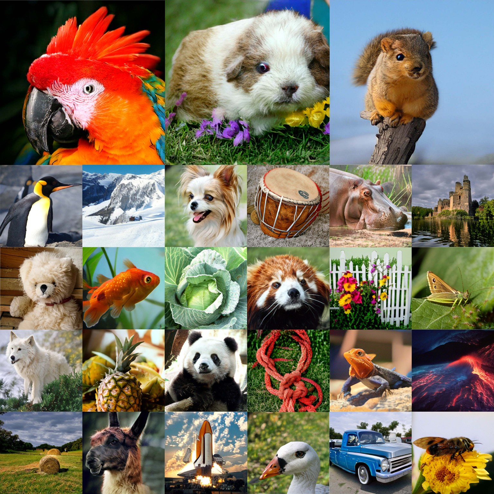

## Sphere Encoder 2

<p>
  <a href="https://arxiv.org/abs/2610.02208">
    </a>
  <a href="https://huggingface.co/tomg-group-umd/sphere2">
    </a>
  <a href="./LICENSE">
    </a>
</p>

Official code and models for [Sphere Encoder 2](https://arxiv.org/abs/2610.02208), a standalone autoencoder that generates images by decoding random points from a high-dimensional latent sphere.
It is the sequel to [Sphere Encoder](https://arxiv.org/abs/2602.15030).

<p>
  
  <br />
  <sub><i>Curated 1-step generation without CFG on ImageNet 512×512.</i></sub>
</p>

---

### Installation

```bash
pip install -r requirements.txt
```

Any PyTorch >= 2.10 should work.
Please set your Hugging Face token first; it is needed to download the pretrained encoders.

```bash
export HF_TOKEN=<YOUR_HF_TOKEN>
```

### Workspace

Everything the code reads and writes lives in a single directory, `workspace/` by default:

```
workspace
├── cache           # auto created, cached models from HF and torch hub
├── pretrained      # auto created, pretrained models
├── datasets        # training and evaluation data
├── experiments     # one folder per model: config and checkpoints
├── fdr6_stats      # FDr^6 reference statistics, downloaded or extracted
├── visualization   # auto created, sampled images
├── editing         # auto created, interpolation and editing results
└── evaluation      # auto created, images generated for evaluation
```

### Model Zoo

| Model | flowers-256px | flowers-512px | imagenet-256px | imagenet-512px |
| :---- | :-----------: | :-----------: | :------------: | :------------: |
| Sphere2-B  | [ckpt](https://huggingface.co/tomg-group-umd/sphere2/tree/main/experiments/sphere2-base-flowers-256px) | [ckpt](https://huggingface.co/tomg-group-umd/sphere2/tree/main/experiments/sphere2-base-flowers-512px) | [ckpt](https://huggingface.co/tomg-group-umd/sphere2/tree/main/experiments/sphere2-base-imagenet-256px) | [ckpt](https://huggingface.co/tomg-group-umd/sphere2/tree/main/experiments/sphere2-base-imagenet-512px) |
| Sphere2-L | [ckpt](https://huggingface.co/tomg-group-umd/sphere2/tree/main/experiments/sphere2-large-flowers-256px) | [ckpt](https://huggingface.co/tomg-group-umd/sphere2/tree/main/experiments/sphere2-large-flowers-512px) | [ckpt](https://huggingface.co/tomg-group-umd/sphere2/tree/main/experiments/sphere2-large-imagenet-256px) | [ckpt](https://huggingface.co/tomg-group-umd/sphere2/tree/main/experiments/sphere2-large-imagenet-512px) |

Models trained with $\mathcal{L}_{\mathrm{FD\text{-}lite}}$ (Sec. B.1 of the paper), marked with † in main Table 2:

| Model | imagenet-256px | imagenet-512px |
| :---- | :------------: | :------------: |
| Sphere2-B<sup>†</sup> | [ckpt](https://huggingface.co/tomg-group-umd/sphere2/tree/main/experiments/sphere2-base-imagenet-fd-lite-256px) | [ckpt](https://huggingface.co/tomg-group-umd/sphere2/tree/main/experiments/sphere2-base-imagenet-fd-lite-512px) |
| Sphere2-L<sup>†</sup> | [ckpt](https://huggingface.co/tomg-group-umd/sphere2/tree/main/experiments/sphere2-large-imagenet-fd-lite-256px) | [ckpt](https://huggingface.co/tomg-group-umd/sphere2/tree/main/experiments/sphere2-large-imagenet-fd-lite-512px) |

Download the checkpoints and place each folder under `workspace/experiments`:

```
workspace/experiments
├── sphere2-base-flowers-256px
│   ├── cfg.json
│   └── ckpt
│       └── ep1999.pth
├── sphere2-base-flowers-512px
├── sphere2-base-imagenet-256px
├── sphere2-base-imagenet-512px
├── sphere2-base-imagenet-fd-lite-256px
├── sphere2-base-imagenet-fd-lite-512px
├── sphere2-large-flowers-256px
├── sphere2-large-flowers-512px
├── sphere2-large-imagenet-256px
├── sphere2-large-imagenet-512px
├── sphere2-large-imagenet-fd-lite-256px
└── sphere2-large-imagenet-fd-lite-512px
```

### Code Overview

The core implementation lives in a few places:

| Where | What |
| :---- | :--- |
| [`G1.forward`](sphere/model.py#L284-L371)  | training forward |
| [`G1.spherify`](sphere/model.py#L377-L421) | spherify process |
| [`G1.generate`](sphere/model.py#L424-L523) | sampling loop |
| [`G1Loss`](sphere/loss.py#L31) | training objective |
| [`ScoreMatchingLoss`](sphere/score/score_loss.py#L107) | latent score matching loss |

`G1` is the dev codename and is kept in the class names.

### Sampling

```bash
bash scripts/sample_flowers.sh
bash scripts/sample_imagenet.sh
```

Images are saved to `workspace/visualization/<model>`.

---

### Dataset

Organize [ImageNet](https://image-net.org/download) as follows:

```
workspace/datasets/imagenet
├── train.json
├── val.json
├── folder_to_id_to_label.json
└── images
    ├── train
    │   ├── n01440764
    │   └── ...
    └── val
        ├── n01440764
        └── ...
```

The json files can be downloaded from [here](https://huggingface.co/tomg-group-umd/sphere2/tree/main/imagenet.json).

[Oxford Flowers](https://www.robots.ox.ac.uk/~vgg/data/flowers/102/) follows the same layout under `workspace/datasets/flowers-102`, with `train.json`, `val.json` and the extracted `jpg` image folder.
The json files can be downloaded from [here](https://huggingface.co/tomg-group-umd/sphere2/tree/main/flowers.json).

### Training

```bash
bash scripts/train_flowers.sh
bash scripts/train_imagenet.sh
bash scripts/train_imagenet_fd-lite.sh
```

### FDr<sup>6</sup> Statistics

Download the pre-computed FDr<sup>6</sup> reference statistics and place them under `workspace/fdr6_stats`:

| Dataset        | 256px and 512px | Reference set    |
| :------------- | :-------------: | :--------------- |
| Oxford Flowers | [stats](https://huggingface.co/tomg-group-umd/sphere2/tree/main/fdr6_stats) | train + val (8K) |
| ImageNet       | [stats](https://huggingface.co/tomg-group-umd/sphere2/tree/main/fdr6_stats) | train (1.28M)    |

Or extract them yourself, at both 256px and 512px:

```bash
bash tools/extract_fdr6_stats_flowers.sh
bash tools/extract_fdr6_stats_imagenet.sh
```

The scripts will download the pretrained encoders and compute the FDr<sup>6</sup> statistics on the reference set with FP32 precision (`--dtype bfloat16` is also supported and faster).

### Evaluation

```bash
bash scripts/eval_flowers.sh
bash scripts/eval_imagenet.sh
```

Result tables are saved to `workspace/experiments/<model>/eval`.

---

### Interpolation

```bash
bash scripts/edit_imagenet.sh        # interpolate between two classes
bash scripts/edit_imagenet_grape.sh  # interpolate an outside image toward a target class
```

Results are saved to `workspace/editing/<model>`.

---

### Sphere Encoder Family

- [Sphere Encoder](https://arxiv.org/abs/2602.15030): the original model, image generation in a spherical latent space.
- [SP³](https://man-sean.github.io/sp3-website/) (NeurIPS 2026): a fast generative prior for image restoration.
- [Efficient Image Synthesis with Sphere Latent Encoder](https://arxiv.org/abs/2605.15592): a few-step loop implemented in latent space.

---

### Contact

Suggestions, issues and pull requests are all very welcome.
Feel free to reach out to Kai at [kaiyuyue@umd.edu](mailto:kaiyuyue@umd.edu).

### License

This project is released under the [MIT License](./LICENSE).
